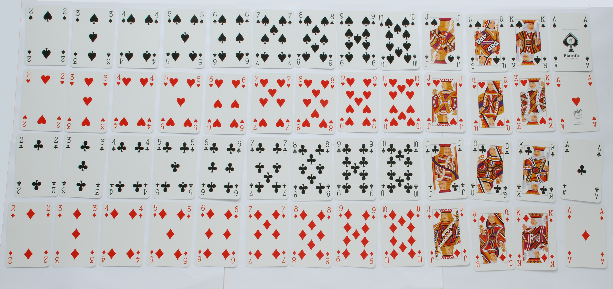

# Assignment 03 - Pemrograman Terstruktur
## Kelas B

#### Nama : Rifki Anashirul
#### NIM : 10221044
-----------------------------
1. Explore and explain about the application of JavaScript function to the organizational issues. Organization issues can range across:
* data management, 
* automation, 
* customer relationship management, 
* inventory management
* financial analysis
  
  You can choose one of the above issues, or a new finding from the internet. Maximum answer is 1000 words.

  Answer:

  JavaScript dapat digunakan untuk mengatasi berbagai masalah organisasi melalui berbagai penerapan seperti manajemen data, otomatisasi, pengelolaan hubungan pelanggan, manajemen persediaan, dan analisis keuangan. Dengan kemampuan untuk memuat data secara dinamis, memvalidasi data, dan mengotomatisasi tugas, JavaScript dapat membantu organisasi dalam meningkatkan efisiensi, produktivitas, dan keefektifan bisnis.

  Isu organisasi yang saya pilih yaitu Customer Relationship Management (CRM) atau yang memiliki arti pengelolaan hubungan pelanggan. JavaScript dapat digunakan dalam berbagai cara untuk mengatasi masalah pengelolaan hubungan pelanggan (CRM). CRM adalah proses manajemen interaksi dengan pelanggan yang bertujuan untuk meningkatkan hubungan dengan pelanggan dan membantu perusahaan mencapai tujuan bisnisnya. CRM menggunakan teknologi, proses, dan strategi untuk mengumpulkan, menyimpan, dan menganalisis informasi tentang pelanggan dan interaksi mereka dengan perusahaan. Dengan menggunakan CRM, perusahaan dapat meningkatkan loyalitas pelanggan, meningkatkan pendapatan, mengurangi kehilangan pelanggan, dan meningkatkan efisiensi bisnis. 
  
  #### Adapun CRM memiliki 3 komponen utama yang penting di dalamnya, yaitu:
  
  1.) Manajemen (Management)

  Komponen dari CRM yang pertama adalah manajemen. Dalam hal ini adalah pihak-pihak yang terlibat dalam kegiatan interaksi dengan pelanggan, seperti agent Call Center, tim Sales, tim Marketing dan lain sebagainya. Dan juga tentang bagaimana strategi mereka dalam menjalankan management hubungan pelanggan yang baik dan tepat.

  2.) Hubungan (Relationship)
  
  Komponen dari CRM yang berikutnya adalah hubungan. Yaitu adalah tentang bagaimana untuk memberikan pelayanan terbaik untuk menciptakan hubungan baik dengan pelanggan dan bagaimana untuk memberikan solusi terbaik untuk setiap permasalahan dan kebutuhan pelanggan.
  
  3.) Pelanggan (Customer)
  
  Komponen dari CRM yang terakhir adalah pelanggan. Pelanggan adalah pusat dari alasan mengapa CRM ada dan dibutuhkan oleh perusahaan. Pelanggan disini meliputi calon pelanggan maupun pelanggan yang sudah ada. Tentang bagaimana cara mendapatkan pelanggan baru dan tetap mempertahankan pelanggan yang sudah ada.

  #### Berikut ini beberapa cara penerapan fungsi JavaScript pada masalah pengelolaan hubungan pelanggan:

    1.) Validasi Data Pelanggan
    
    JavaScript dapat digunakan untuk memvalidasi data pelanggan yang dimasukkan oleh pengguna pada form online. Validasi data ini membantu memastikan bahwa data yang diinput oleh pengguna benar dan sesuai formatnya. Dengan memastikan data pelanggan yang valid, perusahaan dapat memastikan bahwa database pelanggan mereka akurat dan dapat digunakan untuk kepentingan bisnis.

    2.) Pengiriman Email Otomatis
    
    JavaScript dapat digunakan untuk mengotomatisasi pengiriman email pada berbagai kesempatan yang telah ditentukan. Misalnya, perusahaan dapat mengirimkan email kepada pelanggan setiap kali mereka menyelesaikan pembelian, memberikan ulasan, atau merespons tawaran promosi. Hal ini dapat meningkatkan interaksi dan hubungan antara perusahaan dan pelanggan.

    3.) Formulir Online Interaktif
    
    JavaScript dapat digunakan untuk membuat formulir online yang interaktif dan menarik. Formulir ini dapat memungkinkan pelanggan untuk memberikan masukan atau umpan balik, mengajukan pertanyaan atau permintaan dukungan, atau bahkan mengisi formulir pendaftaran. Hal ini dapat membantu perusahaan dalam membangun hubungan dengan pelanggan, serta membantu mengumpulkan data penting yang dapat digunakan untuk kepentingan bisnis.

    4.) Manajemen Data Pelanggan
    
    JavaScript dapat digunakan untuk membantu perusahaan dalam manajemen data pelanggan mereka. Dengan menggunakan pustaka JavaScript seperti React atau Angular, perusahaan dapat membuat aplikasi web yang dapat memungkinkan pengguna untuk melihat dan mengedit data pelanggan secara real-time. Hal ini memungkinkan perusahaan untuk mengelola data pelanggan dengan lebih efektif dan dapat digunakan untuk meningkatkan pengalaman pelanggan.

    5.) Integrasi dengan Platform Pihak Ketiga
    
    JavaScript dapat digunakan untuk mengintegrasikan aplikasi CRM dengan sistem pihak ketiga seperti sistem manajemen inventaris atau platform pembayaran. Integrasi ini memungkinkan perusahaan untuk mengelola data pelanggan dan transaksi secara efektif, serta membantu perusahaan untuk mencapai tujuan bisnisnya.
    
    Dalam kesimpulannya, JavaScript dapat digunakan untuk mengatasi berbagai masalah pada pengelolaan hubungan pelanggan. Dengan memvalidasi data pelanggan, mengotomatisasi pengiriman email, membuat formulir online interaktif, manajemen data pelanggan, dan integrasi dengan platform pihak ketiga, perusahaan dapat meningkatkan interaksi dan hubungan dengan pelanggan mereka. Hal ini dapat membantu perusahaan dalam mencapai tujuan bisnisnya dan membangun hubungan yang kuat dengan pelanggan.

1. Given a shuffled a deck of card (without a joker / 52-card deck), make a JavaScript function that has an input a shuffled deck and give the output of ordered deck. Store the deck of card as an array of string.
   
   The order of the cards followed the below image. From 2 of spades up to Ace of diamonds.

   

   Answer :

   Berikut fungsi JavaScript untuk menyusun kartu sesuai dengan gambar yang diberikan :

   ```js
   function sortCards(deck) {
    const suits = ['Sekop', 'Hati', 'Keriting','Wajik'];
    const ranks = ['2', '3', '4', '5', '6', '7', '8', '9', '10', 'J', 'Q', 'K', 'A'];
    const orderedDeck = [];

    // Membuat setumpuk kartu terurut
    for (let suit of suits) {
      for (let rank of ranks) {
        orderedDeck.push(`${rank} ${suit}`);
      }
    }

    // Mengurutkan setumpuk yang diberikan sesuai urutan
    const sortedDeck = [];
    for (let card of orderedDeck) {
      if (deck.includes(card)) {
        sortedDeck.push(card);
      }
    }

    return sortedDeck;
   }
    const shuffledDeck = [
      '9 Wajik', 'As Hati', '7 Keriting', 'Q Sekop', '5 Keriting', '3 Hati',
      'J Wajik', '8 Keriting', 'K Hati', '4 Wajik', '6 Sekop', '2 Keriting',
      'J Sekop', '10 Hati', 'Q Wajik', '2 Sekop', '7 Wajik', '4 Hati',
      '8 Wajik', '9 Sekop', '3 Wajik', 'K Keriting', '10 Sekop', 'As Sekop',
      '6 Wajik', 'Q Hati', '5 Sekop'
    ];
    
    const sortedDeck = sortCards(shuffledDeck)
    console.log(sortedDeck);
   ```

   Output dari fungsi JavaScript berikut yaitu :
   ```
    [
    '2 Sekop',    '5 Sekop',    '6 Sekop',
    '9 Sekop',    '10 Sekop',   'J Sekop',
    'Q Sekop',    'As Sekop',   '3 Hati',
    '4 Hati',     '10 Hati',    'Q Hati',
    'K Hati',     'As Hati',    '2 Keriting',
    '5 Keriting', '7 Keriting', '8 Keriting',
    'K Keriting', '3 Wajik',    '4 Wajik',
    '6 Wajik',    '7 Wajik',    '8 Wajik',
    '9 Wajik',    'J Wajik',    'Q Wajik'
    ]
    ```
    
   

