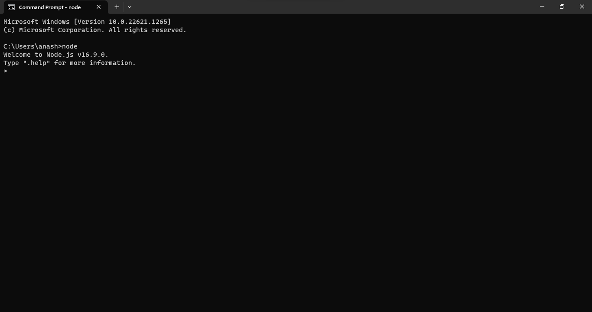

# EXERCISE 1 - PRAKTIKUM PEMROGRAMAN TERSTRUKTUR

## Pengalaman Pada Saat Praktikum

Pada pengenalan praktikum Pemrograman Tersetruktur pertama ialah melakukan pengintsllan terkait Text Editor yang akan di gunakan untuk penulisan code JavaScript.

Pada pertemuan pertama ini kita membahas tentang:

1. Install VSCode
2. Install Node.js
3. Pengenalan Dasar JavaScript
4. Pengenalan Markdown

Dari keempat materi tersebut yang paling ditegaskan tentu saja tentang **JavaScript** karena JavaScript adalah topik utama pada mata kuliah Pemrograman Terstruktur. Namun tidak hanya JavaScript saja, pada pertemuan pertama kemaren juga diajarkan bagaimana kita menghubungkan JavaScript dengan bahasa markup yaitu HTML agar bisa ditampilkan pada web browser. Agar bisa tampil pada brower maka kita perlu menuliskan beberapa tag HTML dan menuliskan kode JavaScript kita di tag ``. Berikut adalah contoh dari struktur HTML yang saya buat pada praktikum kemarin: [_HelloWorld.html_](HelloWorld.html)

JavaScript bisa dijalankan tidak hanya pada browser, tetapi dapat juga dijalankan di terminal dengan menggunakan node. Jadi untuk menampilkan hasil codingan JavaScript di terminal kita perlu menginstall __Node.js__ di website [Node JS](https://nodejs.org/en/). Setelah terintall kita dapat mengecek apakah sudah bisa digunakan atau belum dengan membuka terminal terlebih dahulu lalu mengetikkan command: `node`. Jika Node.js sudah terinstall maka akan muncul tampilan seperti berikut: 

## Kekurangan dan Kelebihan Browser

| Kekurangan                        | Kelebihan                                            |
| --------------------------------- | ----------------------------                         |
| - Loading menjadi lama jika banyak add-ons | - Mudah diakses dan kompatibel                       |
| - Terlalu bergantung pada browser | - Desain responsif untuk semua perangkat             |
| - Lebih lambat dibanding _Node_   | - Tidak memakai memori yang besar                    |

## Kekurangan dan Kelebihan Nodejs
| Kekurangan                                                        | Kelebihan                                                   |
| -----------------------------------------------------------       | ----------------------------------------------------------- |
| - Tidak dapat melihat tulisan sejelas menggunakan _browser_       | - Kurang Masalah dengan Konkurensi                          |
| - Tidak efektif dengan aplikasi skala besar                       | - Sumber Terbuka                                            |
| - Tidak cocok untuk tugas-tugas intensif CPU                      | - Bahasa Java Script                                        |

## Jalankan Code Program

Source code : [_Exercise_1.js_](Exercise_1.js)

> Apakah yang terjadi jika secara terus menerus hanya menjalankan dua baris terakhir?

Dari percobaan yang saya lakukan adalah mengeluarkan hasil dengan indeks baris pertama. Sehingga dalam program yang saya jalankan tidak mengalami acak.