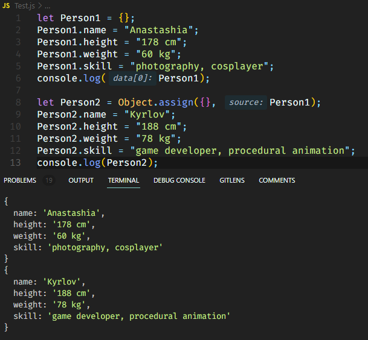

# Tugas Praktikum 4 Pemrograman Terstruktur 

Nama : Rifki Anashirul

NIM : 10221044

1. Tuliksan pengalaman kalian selama seminggu eksplorasi terkait object type ini. Ceritakan dengan bahasa yang kalian pahami.
   
   Jawab:
    pada materi ini yaitu objek, saya menemukan banyak  hal baru yang saya temui, seperti objek yang memiliki banyak persamaan, seperti array, dengan perbedaan bahwa objek ini memiliki nama properti, bukan indeks array, seperti yang telah disebutkan sebelumnya. . , objek memiliki nama properti untuk memudahkan pengembang mengidentifikasi dan menggunakan nilai / nilai properti yang digunakan dalam  program. Beberapa properti objek  JavaScript sendiri memiliki pewarisan prototipe, yang merupakan fungsi objek yang mewarisi properti dari objek yang lebih umum, yang lain adalah Dinamis, yang berarti bahwa properti apa pun dapat ditambahkan ke objek serta dihapus, dan yang ketiga dapat diubah, yang mana artinya nilai properti dapat berubah dengan modifikasi, yang keempat adalah Dimanipulasi dengan referensi, yaitu dua variabel yang terkait dengan objek yang sama  saling mempengaruhi jika kita mengubah salah satu properti dari salah satu variabel ini. Ada beberapa metode yang bisa kita gunakan untuk membuat objek  yaitu  menggunakan object literals, new object_name  dan object.create()

    contoh object literals:
    ```js
    let Mahasiswa = {
    "nama": "Rifki Anashirul",         
    "NIM": 10221044,       
    Minat: {                   
        Akademik: ["Fisika","Manajemen dan Organisasi"],
        Non_Akademik: ["Futsal, Game"]
    }
    };
    console.log("mahasiswa: ", Mahasiswa);
    ```

    contoh dengan object_name:

    ```js
    let o = new Object();   
    console.log(o);
    ```
    contoh dengan object create:
    ```js
    let o1 = Object.create({x: 1, y: 1}); 
    console.log(o1);
    ```
    itu adalah sebahian kecil dari beberapa hal yang saya telah pelajari dari object itu sendiri dimana pada objek objek itu kita bisa membuat objek baru lagi bisa menambahkan,menghapus memanggil,menggandakan,mengubah menjadi string panjang.saya juga mempelajari beberapa method seperti "toString()".

2. - Buatu suatu object kosong (tanpa property apapun) dengan nama Person1.
   ```js
   let Person1 = {};
   ```
   - Cetak object Person1 tersebut di console

   

   - Tambahkan properties berikut:
   ```js
    name: "Anastashia",
    height: "178 cm",
    weight: "60 kg",
    skill: "photography, cosplayer"
    ```
    - Tampilkan nilai nya saja dari properties yang telah ditambahkan

    

    - Gandakan Person1 ke Person2 dan gunakan data berikut:
    ```js
    name: "Kyrlov",
    height: "188 cm",
    weight: "78 kg",
    skill: "game developer, procedural animation"
    ```

    

    - Tukarkan data-data Person1 ke Person2 demikian pula sebaliknya.
        Petunjuk: Gunakan destructuring asssignment.
        Cetak object Person1 dan Person2 ke console.
    
    

    - Cetak object Person1 dan Person2 ke console.
  
    
    


    

